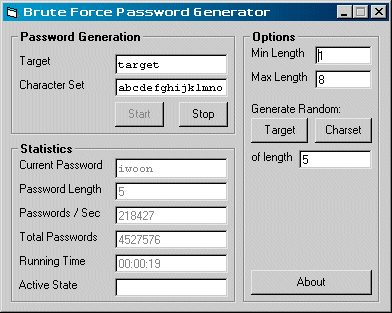



## Brute Force Password Generation

### Description

**This is an update of my previous submission.**

What's New?

Various speed-ups. (40k-80k to 150k-250k passwords/sec).

Got rid of string concatenation replaced with Mid$ function.

Made password producing function an "inline" function, no more repeated calls.

Fixed bug that wouldn't let you close the form even if you hadn't started generating yet.

No more version numbers, just date of release.
 
### More Info
 

             |
---                |---
**Submitted On**   |2003-10-03 21:48:06
**By**             |[redbird77](https://github.com/Planet-Source-Code/PSCIndex/blob/master/ByAuthor/redbird77.md)
**Level**          |Intermediate
**User Rating**    |4.8 (29 globes from 6 users)
**Compatibility**  |VB 4\.0 \(32\-bit\), VB 5\.0, VB 6\.0
**Category**       |[String Manipulation](https://github.com/Planet-Source-Code/PSCIndex/blob/master/ByCategory/string-manipulation__1-5.md)
**World**          |[Visual Basic](https://github.com/Planet-Source-Code/PSCIndex/blob/master/ByWorld/visual-basic.md)
**Archive File**   |[Brute\_Forc1653561032003\.zip](https://github.com/Planet-Source-Code/redbird77-brute-force-password-generation__1-48983/archive/master.zip)

